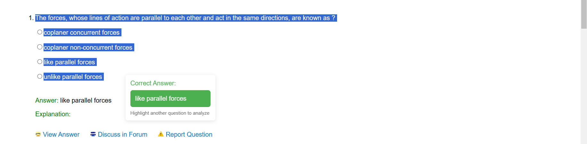

# MCQ Solver Chrome Extension 💡

## Overview
The **MCQ Solver Chrome Extension** enables users to effortlessly highlight multiple-choice questions (MCQs) on any webpage and instantly retrieve the correct answer using the **DeepSeek Chat API**. This tool streamlines MCQ-solving by integrating AI-driven response generation into the browser. 🚀

## Features
- **Seamless MCQ Recognition** ✍️: Automatically detects highlighted MCQs and their respective options on a webpage.
- **Instant Answer Retrieval** ⚡: Displays the correct answer in real-time after text selection.
- **AI-Powered Accuracy** 🤖: Utilizes the **DeepSeek Chat API** for intelligent and context-aware responses.
- **Lightweight and Efficient** 🏎️: Optimized for minimal resource consumption and smooth performance.
- **Secure API Integration** 🔒: Requires an OpenRouter API key for authentication.

## Installation 🛠️
1. Clone or download the extension files from this repository.
2. Open **Google Chrome** and navigate to `chrome://extensions/`.
3. Enable **Developer mode** (toggle located in the top-right corner).
4. Click **Load unpacked** and select the extracted extension folder.

## Usage 📌
1. **API Key Configuration** 🔑: 
   - Open the extension popup.
   - Enter and save your **OpenRouter API key**.
2. **Highlight MCQ** ✨:
   - Select the question and its options by dragging the cursor over them.
3. **Retrieve Answer** ✅:
   - Upon releasing the mouse, the extension processes the highlighted text and provides the correct answer in a popup overlay.

## Technical Details ⚙️
- **Manifest v3 Compatibility**: Ensures compliance with the latest Chrome extension standards.
- **Content Script Execution**: Detects text selection and extracts MCQs dynamically.
- **API Communication** 📡: Securely transmits the selected question data to DeepSeek Chat API for analysis and response generation.
- **Optimized UI** 🎨: A minimalistic, non-intrusive answer display for a seamless browsing experience.

## Requirements 📋
- **Google Chrome (Latest Version)**
- **OpenRouter API Key** (Obtain from [OpenRouter Keys](https://openrouter.ai/keys))

## Screenshots 📸
  
*Example of the extension in action*

[Watch on YouTube](https://youtu.be/4Ikr7zd-CQE?si=ei12fBkjc3nsm6hk)

## License 📜
This project is licensed under the **MIT License**. See the [LICENSE](LICENSE) file for more details.

